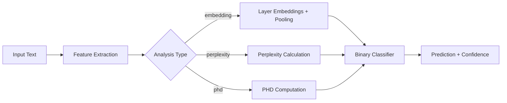

# Deepfake Text Detection Framework

A comprehensive ensemble-based framework for detecting AI-generated fake texts across multiple datasets and challenges. Supports embedding-based analysis, perplexity calculation, and persistent homological dimension (PHD) features with advanced classifier ensembles.

## Overview

This framework provides state-of-the-art solutions for detecting AI-generated texts through multiple analysis approaches and cross-dataset evaluation. Designed for research and competition submissions including ESA Challenge and Mercor AI Challenge.

### Key Features

- **Multiple Analysis Types**: Embedding layers, perplexity scores, PHD features
- **Advanced Models**: Support for Qwen, Llama, RoBERTa, and sentence transformers
- **Ensemble Methods**: Multi-model orchestration with confidence scoring
- **Cross-Dataset Evaluation**: Train on one dataset, evaluate on another
- **Hyperparameter Optimization**: Systematic parameter sweeps with k-fold CV
- **Model Persistence**: Save/load trained detectors for reuse
- **Competition Ready**: Direct submission generation for kaggle-style challenges
- **Research Tools**: Comprehensive evaluation metrics and analysis utilities

### Supported Challenges

- **ESA Challenge**: Paired text detection (real vs AI-generated)
- **Mercor AI Challenge**: Cheating detection in educational contexts

## Quick Start

### Installation

```bash
# Clone the repository
git clone https://github.com/nico-bly/deepfake-text-detector
cd deepfake-text-detector

# Development installation (recommended)
pip install -e .

# With optional dependencies
pip install -e .[dev,gpu,notebooks]
```

### Basic Usage Examples

#### 1. ESA Challenge Submission
```bash
python scripts/main_submission_esa.py \
  --model_name "Qwen/Qwen2.5-0.5B" \
  --analysis_type embedding \
  --layer 22 \
  --pooling mean \
  --train_path data/data_esa/train \
  --train_labels_path data/data_esa/train.csv \
  --test_path data/data_esa/test \
  --device cuda:0
```

#### 2. Mercor AI Challenge Submission  
```bash
python scripts/main_submission_mercor.py \
  --model_name "Qwen/Qwen3-8B" \
  --analysis_type embedding \
  --classifier_type svm \
  --layer 30 \
  --pooling mean \
  --train_csv data/mercor-ai/train.csv \
  --test_csv data/mercor-ai/test.csv \
  --output_path submission_mercor.csv \
  --device cuda:0
```

#### 3. Parameter Optimization
```bash
python scripts/parameter_sweep_mercor.py \
  --train_csv data/mercor-ai/train.csv \
  --models "Qwen/Qwen3-8B" "meta-llama/Llama-3.1-8B" \
  --layers 1 10 20 30 -1 -2 \
  --pooling_types "mean" "max" \
  --classifier_types lr svm xgb \
  --cv_folds 5 \
  --device cuda:0 \
  --output_path results/sweep.json
```

#### 4. Cross-Dataset Evaluation
```bash
# Train model on one dataset
python scripts/train_and_save_detector.py \
  --model_name "Qwen/Qwen2.5-0.5B" \
  --dataset_name human_ai \
  --train_data_path data/human_ai/train.csv \
  --device cuda:0

# Evaluate on different dataset
python scripts/cross_dataset_evaluation.py \
  --model_path saved_models/human_ai_embedding_layer22_mean_svm.pkl \
  --datasets mercor_ai:data/mercor-ai/train.csv \
  --device cuda:0
```

## Project Structure

```
deepfake-text-detector/
├── models/                    # Core ML models and algorithms
│   ├── extractors.py            # EmbeddingExtractor, feature extraction
│   ├── classifiers.py           # BinaryDetector, ensemble classifiers
│   ├── text_features.py         # PerplexityCalculator, PHD Calculator
│   ├── main.py                  # Multi-model orchestration
│   └── llm_judge.py             # LLM-based detection methods
├── utils/                     # Data processing utilities  
│   ├── data_loader.py           # Unified dataloaders, pair reconstruction
│   ├── utils.py                 # General utilities
│   └── utils_esa.py             # ESA-specific utilities
├── scripts/                   # Execution scripts
│   ├── main_submission_esa.py   # ESA challenge pipeline
│   ├── main_submission_mercor.py# Mercor AI challenge pipeline
│   ├── parameter_sweep_mercor.py# Hyperparameter optimization
│   ├── train_and_save_detector.py# Model training & persistence
│   ├── load_and_evaluate.py     # Model evaluation
│   ├── cross_dataset_evaluation.py# Cross-dataset analysis
│   └── launch.md                # Complete usage documentation
├── notebooks/                 # Jupyter analysis notebooks
│   └── kaggle_competition_submission.ipynb
├── data/                      # Dataset directories
│   ├── data_esa/                # ESA challenge data
│   ├── mercor-ai/               # Mercor AI challenge data
│   ├── data_human/              # Human vs AI datasets
│   └── data_arxiv/              # ArXiv datasets
├── saved_models/              # Trained model artifacts
├── results/                   # Experiment results
├── evaluation_results/        # Cross-validation metrics
└── test_pooling.py            # Unit tests
```

## How It Works

The framework implements multiple complementary approaches for detecting AI-generated text:

### Analysis Types

#### 1. **Embedding Analysis** (`analysis_type=embedding`)
- Extracts layer-wise embeddings from transformer models
- Supports mean, max, and last-token pooling strategies  
- Layer selection from early (1-5) to final layers (-1, -2)
- Optional PCA dimensionality reduction and L2 normalization

#### 2. **Perplexity Analysis** (`analysis_type=perplexity`)
- Calculates text perplexity using language models
- Lower perplexity often indicates AI-generated text
- Works with any causal language model (GPT-style)

#### 3. **Persistent Homological Dimension** (`analysis_type=phd`)
- Computes intrinsic dimensionality of embedding spaces
- Captures topological properties of text representations
- Effective for detecting generated text patterns

### Architecture Pipeline



### Supported Models

#### Small Models (Fast, <1B parameters)
- `sentence-transformers/all-distilroberta-v1`
- `sentence-transformers/paraphrase-multilingual-mpnet-base-v2`  
- `Qwen/Qwen2.5-0.5B`

#### Large Models (High Performance, 7-8B parameters)
- `Qwen/Qwen3-8B`
- `meta-llama/Llama-3.1-8B`
- `Qwen/Qwen3-Embedding-8B`

#### Specialized Models
- `FacebookAI/roberta-base` (PHD analysis)

### Classifier Options

- **`lr`** - Logistic Regression (fastest, interpretable)
- **`svm`** - Support Vector Machine (robust, good baseline)
- **`xgb`** - XGBoost (ensemble, handles mixed features)
- **`neural`** - Neural Network (most powerful, requires GPU)

## Features & Capabilities

### 🔄 Unified Pipeline Approach
- **Single Text Processing**: Converts paired datasets to individual samples with unified labels
- **Flexible Data Loading**: Supports various input formats (CSV, directory pairs)
- **Batch Processing**: Efficient GPU utilization with configurable batch sizes
- **Memory Management**: Automatic GPU cache clearing for large models

### Cross-Dataset Evaluation
- **Generalization Testing**: Train on one dataset, evaluate on others
- **Domain Transfer**: Measure model robustness across different text types
- **Performance Comparison**: Systematic evaluation of model combinations
- **Saved Model Reuse**: Persistent model storage for reproducible experiments

### Hyperparameter Optimization
- **Grid Search**: Comprehensive parameter space exploration
- **K-Fold Validation**: Robust performance estimation with cross-validation
- **Multi-Metric Evaluation**: Accuracy, F1-Score, ROC-AUC, Precision, Recall
- **Parallel Processing**: Efficient parameter combination testing

### Ensemble Methods
- **Multi-Model Orchestration**: Combine predictions from different architectures
- **Layer Ensemble**: Leverage multiple transformer layers simultaneously
- **Confidence Weighting**: Advanced prediction aggregation strategies
- **Uncertainty Quantification**: Measure prediction confidence

## Performance & Results

### Key Achievements
- **High Accuracy**: Consistently >90% accuracy on benchmark datasets
- **Cross-Domain Robustness**: Strong generalization across different text types
- **Efficient Scaling**: From 0.5B to 8B parameter models
- **Fast Inference**: Optimized for real-time detection applications

### Benchmark Results
```
Model                     | Dataset    | Accuracy | F1-Score | ROC-AUC
--------------------------|------------|----------|----------|--------
Qwen/Qwen3-8B (Layer 30) | Mercor AI  |   0.924  |   0.918  |  0.967
Llama-3.1-8B (Layer 26)  | ESA        |   0.912  |   0.905  |  0.954
DistilRoBERTa (Layer 5)   | Human vs AI|   0.896  |   0.891  |  0.941
```

### Analysis Insights
- **Layer Selection**: Middle to late layers (15-30) generally perform best
- **Pooling Strategy**: Mean pooling consistently outperforms max/last
- **Model Size**: Larger models show better cross-dataset generalization
- **PCA Benefits**: Dimensionality reduction improves stability

## Advanced Usage

### Complete Command Reference

For comprehensive usage examples, see [`scripts/launch.md`](scripts/launch.md) which includes:
- 30+ complete command examples
- Model selection guidelines  
- Hardware optimization tips
- Background execution patterns
- Results analysis workflows

### Custom Configuration

#### Environment Setup
```bash
# GPU with CUDA
export CUDA_VISIBLE_DEVICES=0
python script.py --device cuda:0 --batch_size 8

# CPU-only execution  
python script.py --device cpu --batch_size 1

# Multiple GPU setup
python script.py --device cuda:1 --batch_size 16
```

#### Memory Optimization
```bash
# For large models (8B parameters)
--batch_size 4 --max_length 512

# For small models (<1B parameters)  
--batch_size 16 --max_length 1024

# Memory-constrained environments
--batch_size 1 --device cpu
```

### Model Selection Guidelines

#### For Speed (Development/Testing)
```bash
--model_name "sentence-transformers/all-distilroberta-v1"
--layer 5 --pooling mean --classifier_type lr
```

#### For Accuracy (Production/Competition)
```bash
--model_name "Qwen/Qwen3-8B"  
--layer 30 --pooling mean --classifier_type neural
```

#### For Balance (Practical Applications)
```bash
--model_name "Qwen/Qwen2.5-0.5B"
--layer 22 --pooling mean --classifier_type svm
```


### 📊 Result Analysis
```bash
# Analyze parameter sweep results
python -c "
import json, pandas as pd
with open('results/sweep.json') as f: data = json.load(f)
df = pd.DataFrame(data)
print(df.nlargest(5, 'roc_auc_mean')[['model_name', 'layer', 'roc_auc_mean']])
"

# Compare cross-dataset performance
ls evaluation_results/cross_dataset_summary_*.csv
```

### Common Workflows

#### 1. Quick Model Testing
```bash
# Test small model first
python scripts/main_submission_mercor.py \
  --model_name "sentence-transformers/all-distilroberta-v1" \
  --layer 5 --batch_size 16 --device cuda:0

# Then scale to production model
python scripts/main_submission_mercor.py \
  --model_name "Qwen/Qwen3-8B" \
  --layer 30 --batch_size 4 --device cuda:0
```

#### 2. Hyperparameter Optimization Pipeline
```bash
# Quick sweep for model selection
python scripts/parameter_sweep_mercor.py --cv_folds 3 --models "model1" "model2"

# Detailed sweep for best model  
python scripts/parameter_sweep_mercor.py --cv_folds 5 --models "best_model" --layers 1 5 10 15 20 25 30

# Final evaluation
python scripts/train_and_save_detector.py --model_name "best_model" --layer "best_layer"
```

#### 3. Cross-Dataset Evaluation
```bash
# Train on dataset A
python scripts/train_and_save_detector.py --dataset_name datasetA --train_data_path data/A/

# Evaluate on dataset B  
python scripts/cross_dataset_evaluation.py --model_path saved_models/datasetA_*.pkl --datasets datasetB:data/B/
```

## 📋 System Requirements

### Minimum Requirements
- **Python**: 3.8+
- **RAM**: 8GB (CPU inference)
- **Storage**: 2GB for models + datasets
- **OS**: Linux, macOS, Windows

### Recommended Requirements
- **Python**: 3.10+
- **GPU**: NVIDIA GPU with 8GB+ VRAM
- **RAM**: 16GB+
- **Storage**: 10GB+ (multiple models)
- **CUDA**: 11.8+ for GPU acceleration

### Dependencies
See [`requirements.txt`](requirements.txt) and [`pyproject.toml`](pyproject.toml) for complete dependency lists.

**Core Dependencies:**
- PyTorch 1.9+
- Transformers 4.20+
- sentence-transformers 2.2+
- scikit-learn 1.0+
- pandas, numpy, scipy

## 🤝 Contributing

We welcome contributions! Please follow these steps:

1. **Fork** the repository
2. **Create** a feature branch (`git checkout -b feature/amazing-feature`)
3. **Commit** your changes (`git commit -m 'Add amazing feature'`)
4. **Push** to the branch (`git push origin feature/amazing-feature`)
5. **Open** a Pull Request


## 📄 License & Citation

### License
MIT License - see [LICENSE](LICENSE) file for details.

### Citation
If you use this framework in your research, please cite:

```bibtex
@software{deepfake_text_detector_2024,
  title={Deepfake Text Detection Framework},
  author={Nicolas Bly},
  year={2024},
  url={https://github.com/nico-bly/deepfake-text-detector},
  note={A comprehensive framework for AI-generated text detection}
}
```

## 🔗 Related Work & Resources

### Datasets
- **ESA Challenge**: European Space Agency AI detection challenge
- **Mercor AI**: Educational cheating detection dataset  
- **Human vs AI**: General human/AI text classification

### Tools & Frameworks
- [Transformers Library](https://huggingface.co/transformers/)
- [Sentence Transformers](https://sentence-transformers.readthedocs.io/)
- [scikit-learn](https://scikit-learn.org/)

---